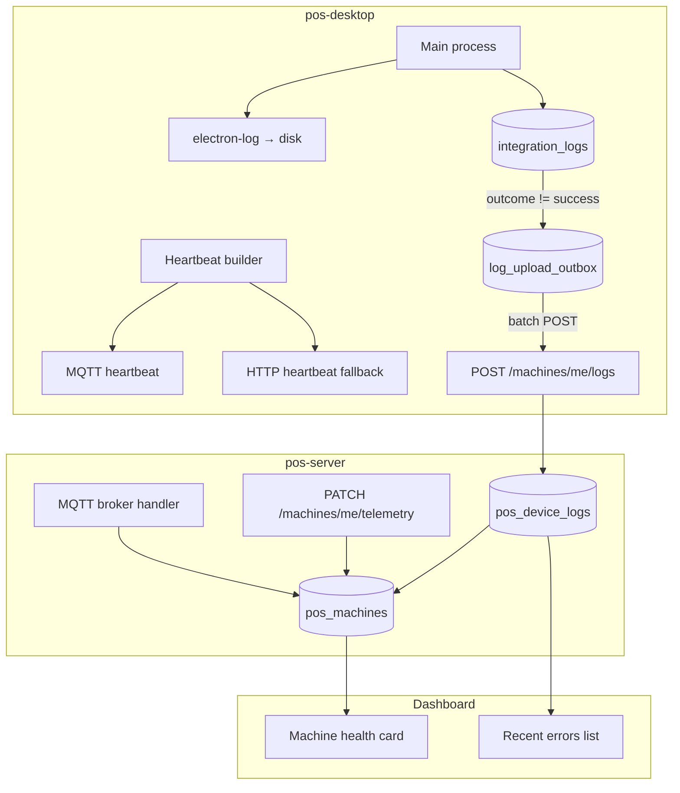

# POS Desktop — Cloud Monitoring Phase 1 Plan

Plan for **local durable logging**, **enriched machine heartbeat**, and **cloud upload of integration failures** so you can monitor POS devices remotely without Sentry yet.

**Status:** Planned (not implemented)  
**Last updated:** 2026-07-03  
**Scope:** pos-desktop + pos-server + dashboard (Machines health UI)  
**Out of scope (Phase 2):** Sentry, PostHog, full log streaming

Related: [REMOTE_UPDATES_PLAN.md](./REMOTE_UPDATES_PLAN.md) (heartbeat `appVersion` fields overlap — implement together or reuse columns)

---

## Goals

1. **Technicians can pull logs on-site** — main-process logs survive app restarts on disk.
2. **Cloud knows machine health** — version, sync backlog, last error, MQTT status, printer config.
3. **Failures surface in the dashboard** — Nayax, print, cash drawer, sync errors visible per machine without visiting the shop.
4. **Offline-safe** — devices queue log uploads; nothing blocks checkout when cloud is down.
5. **Privacy-safe** — no PINs, card data, or full receipt payloads leave the device.

---

## Current state (baseline)

| Area | Today | Gap |
|------|--------|-----|
| **Main logs** | `console.log` / `console.error` in Electron main | Lost on exit; no file rotation |
| **`integration_logs` (SQLite)** | Nayax + cash drawer audit (`type`, `method`, `outcome`, JSON) | Local Settings UI only; no print failures |
| **MQTT heartbeat** | Every 30s: `{ machineId, time }` | No version, health, or last error |
| **Transaction sync stats** | `tx_outbox` pending/failed — exposed via `cloudSyncStats` IPC | Not reported to cloud |
| **Cloud pairing** | Device token + `machineId` + MQTT broker | Reuse for log ingest auth |
| **Dashboard** | Machines page: online, last sync (planned/partial) | No error feed, no log viewer |

**Existing code touchpoints**

- Heartbeat: `electron/mqttClient.ts` → `publishHeartbeat()`, timer in `electron/syncService.ts` (30s)
- Integration logs: `insertIntegrationLog()` in `electron/main.ts`, schema in `integration_logs` table
- Nayax type: `nayax_card_integration`; drawer type: `cash_drawer`
- Transaction outbox pattern (reuse): `electron/transactionSync.ts` — pending/retry/fatal

---

## Architecture overview



---

## Part 1 — Local durable logs (`electron-log`)

### 1.1 Why

Console output is invisible after the app closes. When a shop reports “blank receipt” or “drawer didn’t open”, support needs a file path to inspect without RDP guessing.

### 1.2 Library

Use [`electron-log`](https://github.com/megahertz/electron-log):

- Writes from **main process** (and optionally renderer via IPC bridge)
- Default path on Windows: `%USERPROFILE%\AppData\Roaming\{app name}\logs\main.log`
- Supports rotation via `log.transports.file.maxSize` / archive

### 1.3 Setup (main process)

**New file:** `electron/logger.ts`

```ts
import log from 'electron-log';
import { app } from 'electron';

export function initLogger(): void {
  log.transports.file.level = 'info';
  log.transports.console.level = app.isPackaged ? 'warn' : 'debug';
  log.transports.file.maxSize = 5 * 1024 * 1024; // 5 MB
  log.transports.file.archiveLogFn = (old) => `${old}.old`; // keep one archive
}

/** Replace console.* in main with structured file logging (optional hook). */
export function patchConsole(): void {
  const wrap = (level: 'info' | 'warn' | 'error', orig: typeof console.log) =>
    (...args: unknown[]) => {
      log[level](...args);
      orig.apply(console, args);
    };
  console.log = wrap('info', console.log);
  console.warn = wrap('warn', console.warn);
  console.error = wrap('error', console.error);
}

export { log };
```

**Boot order in `electron/main.ts`:**

1. `initLogger()` — before DB open
2. `patchConsole()` — optional but recommended
3. Log `app.getVersion()`, `process.platform`, resolved DB path on startup

### 1.4 What to log (main)

| Category | Level | Example |
|----------|-------|---------|
| Startup / shutdown | info | version, machineId (if paired), DB path |
| DB pause/resume (sleep) | warn | wake reopen failures |
| MQTT connect/disconnect | info/warn | broker host, reconnect |
| Print | info/error | printer name, success, `failureReason`, pageSize microns |
| Nayax | info/error | method, outcome (not full card payload) |
| Cash drawer | info/error | printer, cashier name (no PIN) |
| Cloud sync | info/warn | flush result, pending count, HTTP status |
| IPC errors | error | handler name + message |

### 1.5 Technician access (no cloud yet)

**Settings → Diagnostics** (small addition):

- Show log file path (read-only)
- Button: **Open logs folder** (`shell.openPath(logDir)`)
- Button: **Copy last 200 lines** (for WhatsApp / support ticket)

**IPC:**

- `get-log-file-path` → string
- `open-logs-folder` → `{ success }`
- `read-recent-logs` → `{ lines: string[] }` (tail, max 200)

### 1.6 Retention

- **On disk:** ~5 MB active + one `.old` archive (~10 MB total per machine)
- **No auto-upload of raw log files in Phase 1** — only structured `integration_logs` failures (Part 3)

---

## Part 2 — Enriched MQTT heartbeat (+ HTTP fallback)

### 2.1 Why

Heartbeat already runs every **30 seconds** when MQTT is connected. Extending the payload gives a live health snapshot on `pos_machines` with zero new polling infrastructure.

### 2.2 Heartbeat payload (v2)

Publish to existing topic: `pos/{tenantId}/{machineId}/heartbeat`

```json
{
  "machineId": "uuid",
  "time": "2026-07-03T07:30:00.000Z",
  "schemaVersion": 2,

  "appVersion": "0.2.0",
  "platform": "win32",
  "osRelease": "10.0.19045",
  "electronVersion": "36.9.5",

  "health": {
    "mqttConnected": true,
    "tradingDayOpen": true,
    "pendingTxSync": 0,
    "failedTxSync": 0,
    "lastCatalogSyncAt": "2026-07-03T07:25:00.000Z",
    "receiptPrinterConfigured": true,
    "drawerPrinterConfigured": true,
    "nayaxConfigured": true
  },

  "lastError": {
    "code": "print_failed",
    "area": "print",
    "message": "Printer not found: BB",
    "at": "2026-07-03T07:28:12.000Z"
  }
}
```

**Rules:**

- `lastError` is **optional** — omit when no recent failure (or send `null`).
- `lastError` is a **single slot** (most recent failure since last successful heartbeat ack). Detailed history lives in `integration_logs` upload (Part 3).
- `schemaVersion` lets the server ignore unknown fields from newer clients.

### 2.3 Building the payload (pos-desktop)

**New file:** `electron/telemetryService.ts`

Responsibilities:

- `buildHeartbeatPayload()` — gather stats from:
  - `app.getVersion()`, `process.platform`, `process.getSystemVersion()`
  - `transactionSyncService.getStats()` → pending/failed counts
  - `syncService.getStatus()` → last catalog sync, MQTT connected
  - `useSettingsStore` equivalents in main (read settings keys for printer names, nayax host)
  - `lastErrorStore` — in-memory ring buffer of 1 (updated by print/nayax/sync failures)
- `publishHeartbeat()` — delegate to `mqttClient.publishHeartbeat(payload)`
- `reportHeartbeatHttp()` — fallback when MQTT disconnected but HTTP reachable

**Update:** `electron/mqttClient.ts`

```ts
publishHeartbeat(payload: HeartbeatPayload): void {
  this.publish(`pos/${tenantId}/${machineId}/heartbeat`, payload);
}
```

**Update:** `electron/syncService.ts` — pass full payload instead of bare `{ machineId, time }`.

### 2.4 HTTP fallback

When MQTT is down but device has `cloud_access_token`:

```
PATCH /api/v1/machines/me/telemetry
Authorization: Bearer {deviceAccessToken}
Content-Type: application/json

{ ...same payload as MQTT heartbeat... }
```

- Call on startup (once)
- Call every **5 minutes** if MQTT disconnected
- Idempotent — server upserts by `machineId`

### 2.5 pos-server changes

**DB migration — extend `pos_machines`:**

| Column | Type | Notes |
|--------|------|-------|
| `app_version` | `VARCHAR(32)` | from heartbeat |
| `platform` | `VARCHAR(32)` | `win32` |
| `os_release` | `VARCHAR(64)` | |
| `last_heartbeat_at` | `TIMESTAMPTZ` | already may exist |
| `last_error_code` | `VARCHAR(64)` | nullable |
| `last_error_area` | `VARCHAR(32)` | `print`, `nayax`, `drawer`, `sync` |
| `last_error_message` | `TEXT` | truncated 500 chars |
| `last_error_at` | `TIMESTAMPTZ` | |
| `health_json` | `JSONB` | full `health` object |
| `telemetry_reported_at` | `TIMESTAMPTZ` | |

**MQTT handler** (`_handle_heartbeat`):

- Parse `schemaVersion >= 2`
- Update columns above
- Set `online = true`, `last_seen_at = now()`

**HTTP route** `PATCH /machines/me/telemetry`:

- Same logic as MQTT handler
- Auth: device bearer token (same as catalog sync)

### 2.6 Dashboard UI (Machines page)

Extend each machine card:

```
┌─ Health ──────────────────────────────┐
│  Online · v0.2.0 · win32              │
│  Trading day: open                    │
│  Tx sync: 0 pending, 0 failed         │
│  Printers: BB / BBILL ✓               │
│  Last error: print_failed — 3 min ago │
│    "Printer not found: BB"            │
└───────────────────────────────────────┘
```

**Fleet summary row:** “2 machines with errors in last 24h”.

i18n: `he.json` + `en.json` in dashboard client.

---

## Part 3 — Cloud upload of `integration_logs` failures

### 3.1 Why

`integration_logs` already captures structured Nayax and drawer events locally. Uploading **failures only** gives a searchable audit trail in the cloud without shipping every successful RPC.

### 3.2 Extend local logging coverage first

Today print failures are **not** in `integration_logs`. Add before upload:

| `type` | `method` | When |
|--------|----------|------|
| `print_receipt` | `printReceipt` | checkout / refund / reprint |
| `print_voucher` | `printVoucher` | voucher issue |
| `print_test` | `printTest` | settings test button |
| `cash_drawer` | `openCashDrawer` | already exists |
| `nayax_card_integration` | RPC method | already exists |

**`outcome` values:** `success`, `error`, `timeout`, `printer_not_found`

**`requestJson` (redacted):**

```json
{
  "printerName": "BB",
  "language": "he",
  "transactionId": "uuid",
  "isCopy": false,
  "isRefund": false
}
```

**`responseJson`:**

```json
{
  "success": false,
  "error": "Printer not found: BB",
  "printed": false
}
```

Never store: HTML body, PIN, Nayax card track data, full receipt lines.

Centralize via:

```ts
function logIntegrationEvent(entry: IntegrationLogEntry): void {
  insertIntegrationLog(db, entry);
  if (entry.outcome !== 'success') {
    telemetryService.recordLastError(entry);
    logUploadService.enqueueFromIntegrationLog(entry);
  }
}
```

### 3.3 Upload outbox (SQLite)

**New table:** `log_upload_outbox`

```sql
CREATE TABLE IF NOT EXISTS log_upload_outbox (
  id TEXT PRIMARY KEY,
  integrationLogId TEXT NOT NULL,
  payload TEXT NOT NULL,           -- JSON ready for API (redacted)
  attempts INTEGER NOT NULL DEFAULT 0,
  status TEXT NOT NULL DEFAULT 'pending',  -- pending | synced | failed
  lastError TEXT,
  createdAt TEXT NOT NULL,
  updatedAt TEXT NOT NULL
);
CREATE INDEX IF NOT EXISTS idx_log_upload_outbox_status ON log_upload_outbox(status, createdAt);
```

Mirror `tx_outbox` retry semantics:

- Batch size: **20** events per POST
- Backoff: 1s → 30s exponential
- Fatal HTTP: 400, 401, 403, 422 → mark `failed`, stop retry (surface in Settings)
- Periodic flush: every **60s** when online
- Flush on: MQTT connect, renderer `online` event, app startup (delayed 10s)

**New file:** `electron/logUploadService.ts`

### 3.4 Cloud API

```
POST /api/v1/machines/me/logs
Authorization: Bearer {deviceAccessToken}
Content-Type: application/json

{
  "events": [
    {
      "id": "client-uuid",           // idempotency key (= integration_logs.id)
      "type": "print_receipt",
      "method": "printReceipt",
      "outcome": "error",
      "request": { ... },
      "response": { ... },
      "createdAt": "2026-07-03T07:28:12.000Z"
    }
  ]
}
```

**Response:**

```json
{
  "accepted": 18,
  "duplicates": 2,
  "rejected": 0
}
```

- Server upserts by `id` (same idempotency contract as transaction sync)
- Return `duplicate` for retries after timeout

**pos-server storage — new table `pos_device_logs`:**

| Column | Type |
|--------|------|
| `id` | UUID PK (client id) |
| `machine_id` | FK → pos_machines |
| `tenant_id` | FK |
| `type` | VARCHAR |
| `method` | VARCHAR |
| `outcome` | VARCHAR |
| `request_json` | JSONB |
| `response_json` | JSONB |
| `created_at` | TIMESTAMPTZ (device time) |
| `received_at` | TIMESTAMPTZ (server time) |

Index: `(machine_id, created_at DESC)`, `(tenant_id, type, created_at DESC)`.

**Query API for dashboard:**

```
GET /api/v1/pos/machines/{machineId}/logs?limit=50&outcome=error&type=print_receipt
```

Auth: Clerk user with access to tenant (not device token).

### 3.5 Dashboard — error feed

Per machine detail or expandable card:

- Last 20 errors (type, method, outcome, time, message snippet)
- Filter: print / nayax / drawer / sync
- Link from heartbeat `last_error` to full log row

Optional: tenant-wide **Errors** tab — all machines, last 24h.

---

## Part 4 — Privacy & redaction policy

### Never upload or put in heartbeat

- Cashier PIN or password hashes
- Nayax card number / track / EMV blobs
- Full `requestJson` from Nayax if it contains PAN — strip in `logIntegrationEvent`
- Receipt HTML or line-item product lists
- `cloud_access_token`, MQTT password

### Allowed in cloud logs

- Machine / transaction UUIDs
- Printer **names** (BB, BBILL)
- Error strings (truncated 500 chars)
- Payment method enum (`cash` / `card`)
- Amounts (optional — default **omit** in Phase 1)

### Redaction helper

**New file:** `electron/logRedaction.ts`

```ts
export function redactForCloud(type: string, request: unknown, response: unknown): { request: unknown; response: unknown }
```

Unit tests for Nayax payload stripping.

---

## Part 5 — Offline & failure behavior

| Scenario | Behavior |
|----------|----------|
| No internet | Logs stay in SQLite + disk; heartbeat skipped; outbox grows |
| MQTT down, HTTP up | HTTP telemetry every 5 min; log upload via HTTP |
| HTTP 401 | Stop upload; surface “re-pair device” in Settings |
| Disk full | `electron-log` fails silently; integration_logs insert still works |
| Large backlog | Upload oldest-first; cap outbox at 1000 rows then drop oldest **synced** only |

**Non-blocking rule:** Log upload runs on timer / background — never `await` in checkout or print IPC handlers.

---

## Part 6 — Implementation task breakdown

### Milestone A — Local logs (pos-desktop only)

| # | Task | Files |
|---|------|-------|
| A1 | Add `electron-log` dependency | `package.json` |
| A2 | Create logger module + boot hook | `electron/logger.ts`, `electron/main.ts` |
| A3 | Replace critical `console.error` in print/nayax with `log.error` | `electron/main.ts` |
| A4 | IPC: log path, open folder, tail | `electron/main.ts`, `preload.ts`, `electron.d.ts` |
| A5 | Settings diagnostics UI | `SettingsPage.tsx`, i18n |

**Acceptance:** After restart, `main.log` contains startup line; technician can open folder from Settings.

### Milestone B — Heartbeat v2

| # | Task | Files |
|---|------|-------|
| B1 | `telemetryService.ts` + lastError slot | new |
| B2 | Extend `publishHeartbeat(payload)` | `mqttClient.ts`, `syncService.ts` |
| B3 | HTTP fallback PATCH telemetry | `telemetryService.ts`, pos-server route |
| B4 | DB migration + MQTT handler | pos-server |
| B5 | Machines dashboard health block | dashboard client |

**Acceptance:** Machines page shows app version + pending sync + last error within 60s of a forced print failure.

### Milestone C — Integration log upload

| # | Task | Files |
|---|------|-------|
| C1 | Log print/voucher/test to `integration_logs` | `electron/main.ts`, `printReceipt` path |
| C2 | `log_upload_outbox` migration | `electron/main.ts` schema |
| C3 | `logUploadService.ts` (enqueue, flush, retry) | new |
| C4 | Wire `logIntegrationEvent()` | `electron/main.ts` |
| C5 | `POST /machines/me/logs` + `pos_device_logs` table | pos-server |
| C6 | `GET .../logs` for dashboard | pos-server + client |
| C7 | Dashboard error list UI | dashboard client |

**Acceptance:** Failed test print on device → appears in cloud machine logs within 2 min; duplicate retry does not duplicate rows.

### Suggested order

```
A (1–2 days) → B (2–3 days) → C (3–4 days)
```

B and C can partially parallelize if two developers (desktop vs server).

---

## Part 7 — Testing plan

### pos-desktop (manual + unit)

- [ ] `electron-log` file created on Windows after packaged build
- [ ] Log rotation at 5 MB creates `.old` file
- [ ] Heartbeat payload includes `appVersion` and `health.pendingTxSync`
- [ ] Simulated print failure sets `lastError` and enqueues outbox row
- [ ] Offline: 10 failures → go online → all uploaded once
- [ ] 401 from log API → row marked failed, Settings shows warning
- [ ] Redaction unit test: Nayax request with PAN field → stripped

### pos-server

- [ ] MQTT heartbeat v2 updates `pos_machines.health_json`
- [ ] `POST /machines/me/logs` idempotent on same `id`
- [ ] Dashboard GET returns only tenant’s machines
- [ ] Truncation: 600-char error message stored as 500

### End-to-end

1. Pair device → verify heartbeat shows version on dashboard  
2. Settings → Test print to invalid printer name → error in dashboard within 2 min  
3. Disconnect network → cause Nayax timeout → reconnect → log appears  
4. Technician → Open logs folder → `main.log` contains print error line  

---

## Part 8 — Rollout

1. **Deploy pos-server** first (new columns + APIs; ignore unknown heartbeat fields from old clients).
2. **Release pos-desktop** with Milestone A only (logs on disk) — zero cloud risk.
3. **Release pos-desktop** with B + C — monitor upload volume for one week.
4. **Enable dashboard** error feed for internal tenant first, then all tenants.

**Feature flag (optional):** `settings.log_upload_enabled` default `true`; server can disable per tenant via settings sync later.

---

## Part 9 — Metrics to watch post-launch

| Metric | Source | Alert if |
|--------|--------|----------|
| Heartbeat age | `pos_machines.last_heartbeat_at` | > 5 min while shop hours |
| Failed tx sync | `health.failedTxSync` | > 0 for 30 min |
| Print error rate | `pos_device_logs` type=print_* | > 5/hour per machine |
| Log upload backlog | outbox count (sample via heartbeat) | > 100 |
| 401 on upload | server logs | any (pairing broken) |

Phase 2 adds Sentry alerts for uncaught exceptions; Phase 1 covers **operational** failures you already instrument locally.

---

## Part 10 — File checklist (summary)

### pos-desktop (new/modified)

| File | Change |
|------|--------|
| `package.json` | `electron-log` |
| `electron/logger.ts` | **new** |
| `electron/telemetryService.ts` | **new** |
| `electron/logUploadService.ts` | **new** |
| `electron/logRedaction.ts` | **new** |
| `electron/mqttClient.ts` | heartbeat payload |
| `electron/syncService.ts` | build + send payload |
| `electron/main.ts` | schema, logIntegrationEvent, IPC, print logging |
| `electron/preload.ts` | log diagnostics IPC |
| `src/types/electron.d.ts` | new IPC types |
| `src/components/settings/SettingsPage.tsx` | diagnostics section |
| `src/i18n/translations/*.ts` | new strings |
| `docs/CLOUD_MONITORING_PHASE1_PLAN.md` | this doc |

### pos-server (new/modified)

| Area | Change |
|------|--------|
| Migration | `pos_machines` columns, `pos_device_logs` table |
| MQTT | heartbeat v2 parser |
| Routes | `PATCH /machines/me/telemetry`, `POST /machines/me/logs`, `GET /pos/machines/{id}/logs` |
| Dashboard API | enrich machine list with `last_error`, `health` |

---

## Part 11 — Phase 2 preview (not in scope)

After Phase 1 is stable:

- **Sentry Electron** — uncaught exceptions, breadcrumbs on print/checkout
- **PostHog** — `pos_print_failed` event counts (you already have PostHog org)
- **Optional:** upload last 50 KB of `main.log` on explicit “Send diagnostics to support” button

---

## Open questions

1. **Log retention in cloud** — 30 days default? Per-tenant configurable?
2. **Amounts in print logs** — include transaction total for support, or omit entirely?
3. **Tenant admin notifications** — email/Slack when `last_error` is new? (defer to Phase 2?)
4. **pos-server repo location** — implement server side in same monorepo as dashboard or separate `pos-server` repo?

---

## Decision summary

| Choice | Recommendation |
|--------|----------------|
| Local logs | `electron-log`, 5 MB rotation |
| Health signal | Extend existing MQTT heartbeat + HTTP fallback |
| Error detail | Upload failed `integration_logs` only |
| Auth | Existing device bearer token |
| Idempotency | Client UUID = `integration_logs.id` |
| PII | Redact before enqueue; never upload PIN/card/HTML |

**Estimated total effort:** ~7–10 dev days (desktop + server + dashboard UI).
