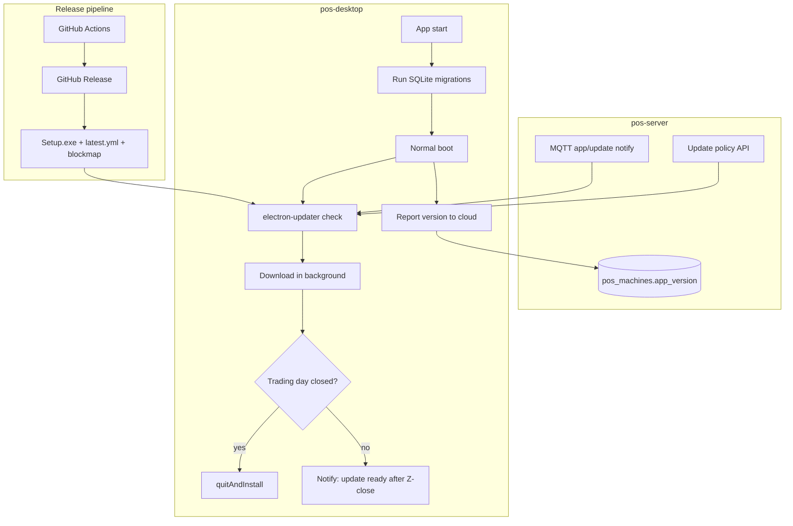

# POS Desktop — Remote Updates Plan (Phase B)

Plan for auto-updates via `electron-updater`, app version visibility on the cloud **Machines** health panel, and **SQLite migrations** on every upgrade.

**Status:** Planned (not implemented)  
**Last updated:** 2026-07-02  
**Minimum OS:** Windows 10+ (Electron 36)

---

## Current state (baseline)

| Area | Today |
|------|--------|
| **Version** | Local only (`package.json` → `getAppVersion` → badge in header) |
| **Distribution** | GitHub Actions builds NSIS `.exe` + `.blockmap`, uploads as **artifact** (30 days, not a release feed) |
| **Cloud machine health** | MQTT online, last sync, catalog freshness, trading day — **no app version** |
| **Heartbeat** | MQTT `pos/{tenant}/{machine}/heartbeat` with `{ machineId, time }` only |
| **SQLite schema** | `createSchema()` + ad-hoc `ALTER TABLE …` in try/catch in `electron/main.ts` — **no version number, no ordered migrations** |

---

## Goals

1. **Auto-update** — download and install new POS Desktop builds remotely (with safe timing).
2. **Cloud visibility** — each machine shows **current app version** (and DB schema version) in the Machines page health section.
3. **DB migrations** — when a new app version adds/changes SQLite schema, upgrades apply automatically on next launch without corrupting data.

---

## Architecture overview



---

## Part 1 — Release infrastructure

### 1.1 Publish updates (not just artifacts)

Change CI so every tagged release (or chosen `main` builds) publishes to **GitHub Releases**:

- `POS-Desktop-{version}-Setup.exe`
- `POS-Desktop-{version}-Setup.exe.blockmap` (delta updates)
- `latest.yml` (required by `electron-updater`)

**electron-builder config** (`package.json`):

```json
"publish": {
  "provider": "github",
  "owner": "manorlh",
  "repo": "pos-desktop"
}
```

CI step: `electron-builder --win --publish always` (with `GH_TOKEN`).

**Release policy recommendation:**

- **Production tills:** only publish on **git tags** (`v0.2.1`) — predictable, auditable.
- **Optional:** `main` builds stay as artifacts only for internal QA.

### 1.2 Code signing (important for production)

Unsigned auto-updates on Windows trigger SmartScreen warnings and may block silent install.

| Stage | Approach |
|-------|----------|
| **Dev / pilot** | Unsigned OK; technician installs manually if needed |
| **Production** | EV/OV code signing cert + sign in CI (`CSC_LINK` / `CSC_KEY_PASSWORD`) |

Plan signing as a **pre-production gate**, not a blocker for initial implementation.

---

## Part 2 — Cloud version reporting & Machines UI

### 2.1 Server data model

Add to `pos_machines` (Alembic migration):

| Column | Type | Purpose |
|--------|------|---------|
| `app_version` | `VARCHAR(32)` | e.g. `0.2.0` |
| `db_schema_version` | `INTEGER` | local SQLite migration level |
| `app_version_reported_at` | `TIMESTAMPTZ` | last time device reported |
| `os_platform` | `VARCHAR(32)` | e.g. `win32` |
| `os_release` | `VARCHAR(64)` | e.g. `10.0.19045` |

Keep `device_info` JSON for extras (Electron version, arch, etc.) but use **queryable columns** for dashboard filters.

### 2.2 How the POS reports version

**A. MQTT heartbeat** (extend `mqttClient.publishHeartbeat`):

```json
{
  "machineId": "...",
  "time": "2026-07-02T19:00:00Z",
  "appVersion": "0.2.0",
  "dbSchemaVersion": 7,
  "platform": "win32",
  "osRelease": "10.0.19045"
}
```

Server `_handle_heartbeat` updates `app_version`, `db_schema_version`, `last_heartbeat_at`.

**B. HTTP fallback** — `POST /sync/{machineId}/heartbeat` or `PATCH /machines/{id}/telemetry` when MQTT is down (same payload).

### 2.3 Update policy API (cloud-controlled)

New endpoint: `GET /sync/{machineId}/app-update`

```json
{
  "latestVersion": "0.2.1",
  "minVersion": "0.2.0",
  "mandatory": false,
  "releaseNotes": "Printer routing fix",
  "feedUrl": "https://github.com/manorlh/pos-desktop/releases/latest/download/",
  "publishedAt": "2026-07-02T18:00:00Z"
}
```

**Source of truth options:**

| Option | Pros |
|--------|------|
| **A. Env/config on server** (`POS_LATEST_VERSION`, `POS_MIN_VERSION`) | Simple, fast to ship |
| **B. Tenant settings JSONB** | Per-org rollout later |
| **C. Query GitHub Releases API** | Single source; server caches latest tag |

**Recommendation:** Start with **A**, evolve to **B** for staged rollout.

### 2.4 Machines page UI (health section)

New health block per machine card (same style as MQTT / sync):

```
┌─ App version ─────────────────────┐
│  v0.2.0          [Up to date]     │
│  or v0.1.7       [Update available] │
│  or v0.1.0       [Update required]  │
│  DB schema: 7                     │
│  Reported 2 min ago               │
└───────────────────────────────────┘
```

Optional fleet summary: “3 machines outdated, 1 requires update”.

Extend `PosMachine` type, `normalizePosMachine`, `_enrich_machine_status`, and i18n.

---

## Part 3 — SQLite migration framework

### 3.1 Problem today

Schema changes are scattered `ALTER TABLE` try/catch blocks inside `createSchema()`. That works for additive columns but:

- No single **schema version** number
- Hard to know what ran on which device
- Risky for renames, data backfills, index changes
- Updates can ship new code expecting columns that don’t exist if `ALTER` fails silently

### 3.2 Target design

**New table** (migration 001):

```sql
CREATE TABLE IF NOT EXISTS schema_migrations (
  version INTEGER PRIMARY KEY,
  applied_at TEXT NOT NULL,
  description TEXT
);
```

**Migration modules** — `electron/db/migrations/`:

```
001_initial_baseline.ts
002_add_tip_columns.ts
003_add_printer_settings.ts
...
```

Each export:

```ts
export const version = 7;
export const description = 'add local printer override keys';
export function up(db: Database) { /* SQL */ }
```

**Runner** (`electron/db/migrate.ts`):

1. Read `MAX(version)` from `schema_migrations` (0 if empty).
2. Run all migrations where `version > current` **in order**, inside a **transaction** per migration.
3. On failure: **abort startup**, show blocking error UI, log details.
4. Return final version → report to cloud as `dbSchemaVersion`.

### 3.3 Bootstrap existing databases

One-time **baseline migration** that sets version to current consolidated state (e.g. `7`) and absorbs existing inline `ALTER TABLE` logic over time.

**Rule going forward:** new schema changes = **new numbered migration only**, not new try/catch in `createSchema()`.

### 3.4 When migrations run

```
App launch (new .exe)
  → acquire DB lock (single instance)
  → runMigrations(db)        ← BEFORE sync, MQTT, sales
  → createSchema()             ← CREATE IF NOT EXISTS for fresh DBs
  → init services
  → report version + schema to cloud
  → check for app updates
```

### 3.5 Migration authoring rules

| Rule | Why |
|------|-----|
| Migrations only **add** or **backfill**; avoid destructive drops | POS data is local until synced |
| New columns: `DEFAULT` or nullable | Old rows must load |
| Heavy backfills: batch + log progress | Large DBs on old tills |
| Bump `minVersion` on server if old app cannot work with new cloud API | Force update |

### 3.6 Cloud visibility for schema

Show `dbSchemaVersion` on Machines page. Alert if schema is below what latest app expects (failed migration or very old binary).

---

## Part 4 — Auto-update client (`electron-updater`)

### 4.1 Main-process service

New `electron/appUpdateService.ts`:

| Responsibility | Detail |
|----------------|--------|
| Configure feed | `autoUpdater.setFeedURL` from cloud `feedUrl` or GitHub default |
| Check | On startup (delayed ~30s), every 6h, on MQTT `app/update/notify` |
| Download | `autoUpdater.downloadUpdate()` in background |
| Events | Forward to renderer: `update-available`, `update-downloaded`, `error` |
| Install | `autoUpdater.quitAndInstall()` only when **safe** |

Use `electron-log` for update logs on disk.

### 4.2 MQTT notify

- Subscribe: `pos/{tenant}/{machine}/app/update/notify`
- Server publishes when new release is published (GitHub webhook → pos-server, or manual “notify fleet” in dashboard)
- Debounced → `checkForUpdates()`

### 4.3 Safe install gating (POS-specific)

**Do not** `quitAndInstall` when:

- Trading day is **open**
- Checkout / sale in progress
- User chose “install later” for this session

**Allowed when:**

- Trading day closed (or no day)
- Update fully downloaded
- User confirms OR technician triggers from Settings

**UI surfaces:**

| Location | Behavior |
|----------|----------|
| **Settings → Updates** | Current version, check now, download status, “Install and restart” |
| **Header badge** | “Update ready” indicator |
| **Blocking modal** | Only if `mandatory` and below `minVersion` after Z-close |

### 4.4 Mandatory / minimum version

If `appVersion < minVersion`:

- Allow **finish open day** and **sync**
- **Block new sales** with clear message
- After Z-close → prompt install (or auto-install per policy)

---

## Part 5 — Implementation phases

### Phase B1 — Foundation (no auto-install yet)

**Repos:** pos-desktop + pos-server

- SQLite migration framework + baseline migration
- Report `appVersion` + `dbSchemaVersion` in heartbeat
- Server columns + heartbeat handler + enrich `/machines`
- Machines page: app version health block
- GitHub Releases publish in CI

**Deliverable:** Version visible in cloud; releases publishable; DB migrations structured.

### Phase B2 — Auto-update

**Repos:** pos-desktop + pos-server

- `electron-updater` integration
- `GET /sync/{machineId}/app-update` policy endpoint
- Settings UI + “update ready” notifications
- Install gating on trading day
- MQTT `app/update/notify` + subscribe

**Deliverable:** Tills auto-download and install after Z-close.

### Phase B3 — Operations & rollout

**Repo:** pos-server (+ dashboard)

- Dashboard: publish update / set `minVersion` / release notes
- Fleet summary: outdated count
- Optional: per-tenant `latestVersion` override
- Code signing in CI
- Runbook: rollback (previous `latest.yml` + lower `minVersion`)

---

## Part 6 — Files / components (estimate)

### pos-desktop

| File | Change |
|------|--------|
| `electron/db/migrate.ts` | Migration runner |
| `electron/db/migrations/*.ts` | Numbered migrations |
| `electron/appUpdateService.ts` | electron-updater wrapper |
| `electron/main.ts` | Migrations before init; updater IPC |
| `electron/mqttClient.ts` | Subscribe `app/update/notify`; extend heartbeat |
| `electron/preload.ts` + `src/types/electron.d.ts` | Update IPC + events |
| `src/components/settings/UpdatesCard.tsx` | Update UI |
| `package.json` | `electron-updater`, publish config |
| `.github/workflows/build-windows.yml` | Publish to GitHub Releases |

### pos-server

| File | Change |
|------|--------|
| `alembic/versions/..._app_version_on_machines.py` | New columns |
| `app/models/pos_machine.py` | Fields |
| `app/schemas/pos_machine.py` | Response fields |
| `app/services/mqtt.py` | Parse version from heartbeat |
| `app/routers/sync.py` | `GET .../app-update` |
| `app/services/app_update.py` | Policy logic (new) |
| `client/.../machines/page.tsx` | Version health UI |
| `client/src/lib/types.ts` | `appVersion`, `dbSchemaVersion`, update status |

---

## Part 7 — Testing plan

| Test | How |
|------|-----|
| Fresh install | Empty DB → migrations 1..N → schema version N |
| Upgrade from 0.2.0 | Keep real `pos.db`, install 0.2.1, verify migrations + data |
| Failed migration | Broken migration → app blocks, DB unchanged |
| Auto-update | Publish to GH Releases; old till downloads, installs after Z-close |
| Open day guard | Update downloaded during open day → no restart until closed |
| Mandatory version | `minVersion` above device → block checkout |
| Cloud UI | Machines page shows version + outdated badges |
| Offline | Download when online; install when ready + day closed |

---

## Part 8 — Open decisions

| # | Question | Recommended default |
|---|----------|---------------------|
| 1 | Release channel: GitHub Releases only, or own CDN? | GitHub Releases |
| 2 | Auto-install: technician click vs auto after Z-close? | Technician confirms; optional auto later |
| 3 | Mandatory updates: block sales immediately or after day ends? | After day ends (unless security emergency) |
| 4 | Code signing: pilot unsigned or wait for cert? | Unsigned pilot; signing before fleet rollout |
| 5 | Tag strategy: every version on `v*` tag? | Yes — `v*` triggers release + MQTT notify |

---

## Related repos

- **pos-desktop** — Electron app, updater, SQLite migrations, CI release
- **pos-server** — Machine telemetry, update policy API, Machines dashboard UI
